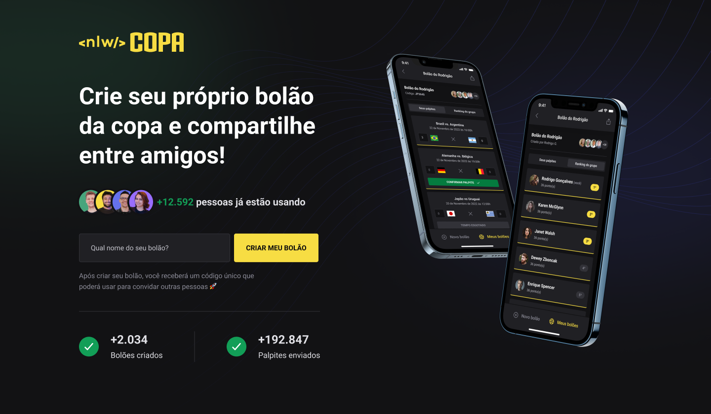

<h1 align="center"> NLW - Bolão da Copa </h1>

  <a href="#-tecnologias">Tecnologias</a>&nbsp;&nbsp;&nbsp;|&nbsp;&nbsp;&nbsp;
  <a href="#-projeto">Projeto</a>&nbsp;&nbsp;&nbsp;|&nbsp;&nbsp;&nbsp;
  <a href="#memo-licença">Licença</a>

  

 

  

## 🚀 Tecnologias

Esse projeto foi desenvolvido com as seguintes tecnologias:

- [Node e NPM](https://nodejs.org/)
- [Expo](https://expo.dev/)
- [Prisma](https://www.prisma.io/)
- [React](https://pt-br.reactjs.org/)
- [React Native](https://reactnative.dev/)

## 💻 Projeto

O Bolão da Copa é um aplicativo que genrencia um bolào real para a copa do mundo, onde é possível adicionar novos usuarios se autenticando via google, criando bolões e dando palpites nos jogos.

## :memo: Licença

Esse projeto está sob a licença MIT.

---

Feito com ♥ by Ricardo Pessoa